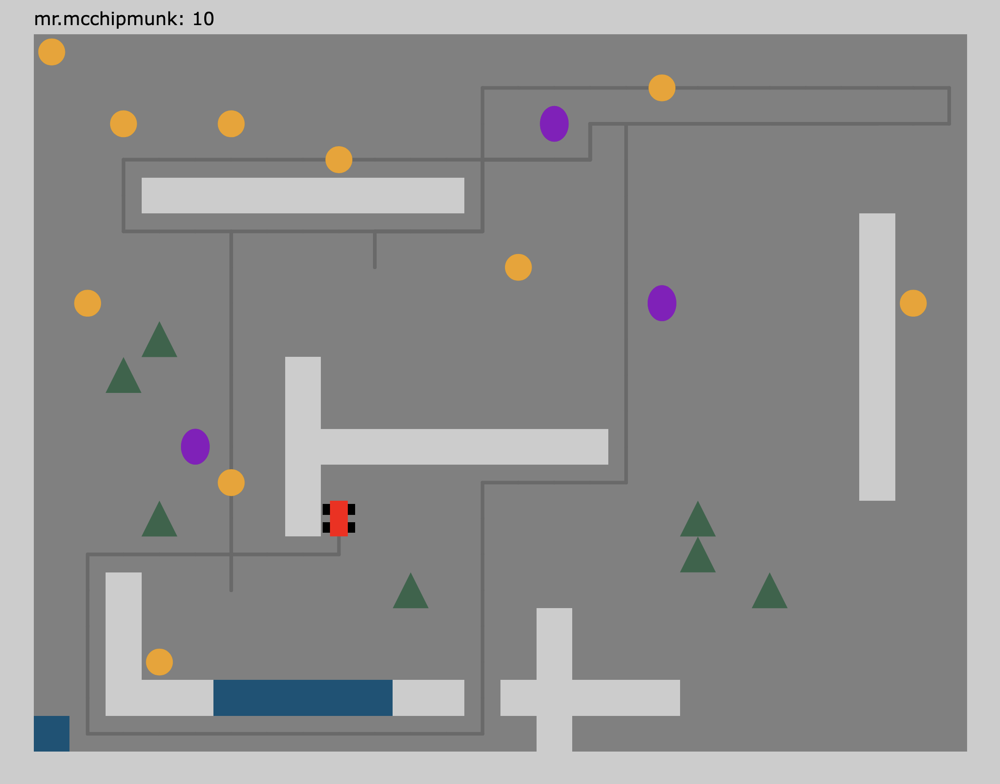

# Buggy Buggies

Buggy Buggies is a meta-game where you navigate a virtual dune-buggy to avoid traps and collect more coins than their opponents. Your tools to accomplish this task include the following apis:

```
- GET /api/host/<handle>
- GET /api/game/<game_id>/join/<handle>
- GET /api/game/<game_id>/player/<secret>/move/<N|E|S|W>
- GET /api/game/<game_id>/player/<secret>/info
```

The meta-game is how to use these APIs to write a bot to play Buggy Buggies.



### DEV

    mix deps.get
    mix compile
    mix start
    open http://localhost:4000

### TODO
    add player collisions
    rename modules
    add distinct player colors
    make tire-tracks fade
    update readme
