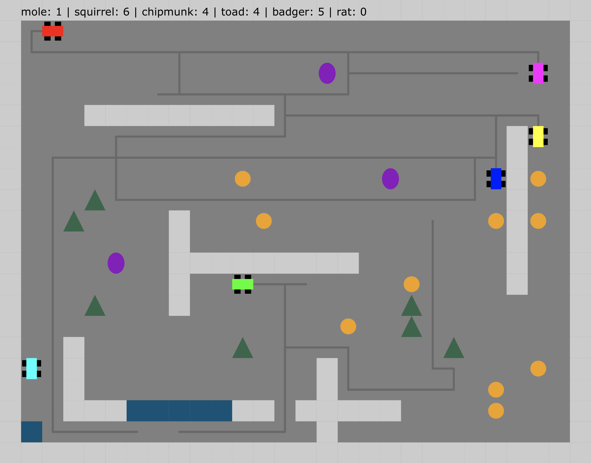

# Buggy Buggies

Buggy Buggies is a meta-game where you navigate a virtual dune-buggy to avoid traps and collect more coins than your opponents. Your tools to accomplish this task include the following apis:

```
- GET /api/host/<handle>
- GET /api/game/<game_id>/join/<handle>
- GET /api/game/<game_id>/player/<secret>/move/<N|E|S|W>
- GET /api/game/<game_id>/player/<secret>/info
```

The meta-game is how to use these APIs to write a bot to play Buggy Buggies.

<a href="https://buggy-buggies.gigalixirapp.com/">https://buggy-buggies.gigalixirapp.com/</a>

<a href="https://buggy-buggies.gigalixirapp.com/" target="_blank">
  
</a>


## Complete API

### Join Game
```
GET  /api/host/:handle                // create game and join
GET  /api/game/:game_id/join/:handle  // join game
```

### Player API
```
GET  /api/game/:game_id/player/:secret/info             // get game state
GET  /api/game/:game_id/player/:secret/move/:direction  // move buggy 1 square
```

### Host API
```
GET  /api/game/:game_id/player/:secret/reset  // resets all players' positions and purses
GET  /api/game/:game_id/player/:secret/purge  // TODO: removes all players from game other than host
```

### RUN LOCALLY

Install Elixir: https://elixir-lang.org/install.html

    mix deps.get
    mix compile
    mix start

goto http://localhost:4000

    SANDBOX=true mix start  # run with rate limiting turned off

